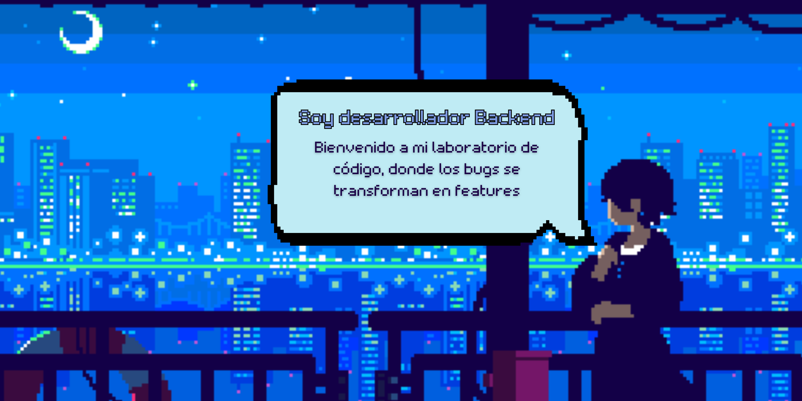

<h1 align="center">Holaa, soy Santiago Oliva</h1>

<h2> SOBRE MI </h2>

### **¡Hola a todos! 👋**

Soy **Santiago Oliva**, estudiante avanzado de la **Tecnicatura en Programación** en la UTN. Estoy cerrando el 1er año y ya enfocado en las materias de 2do ciclo.
Mi gran pasión es el desarrollo **Backend** con foco en la **Programación Orientada a Objetos (POO)**. Me especializo en **Java** y en el diseño de **algoritmos y estructuras de datos** para crear soluciones súper eficientes y de alto rendimiento.

#### ⚙️ Mi Foco Técnico

Mi stack principal se centra en **Java SE** y el manejo de **Bases de Datos Relacionales** (MySQL) con un dominio sólido de **SQL** y *JOINS*. Aseguro la calidad del código mediante **Git** y **GitHub** para el control de versiones. Además, cuento con experiencia en **C** y **C#**.

#### 🔥 **Tecnologías**  

 

#### **💾 Base de datos**

#### **🛠️ Herramientas/Flujo de Trabajo**

#### **💻 Sistemas Operativos**
 

#### **💻 IDEs/Editores de texto**

#### **🎨 Diseño**

#### 📫 **Social**  

#### 📈 Mis Estadísticas de GitHub 

  *Las estadísticas de actividad se cargarán en breve. ¡Mientras tanto, explora mis repositorios!*

  

  

